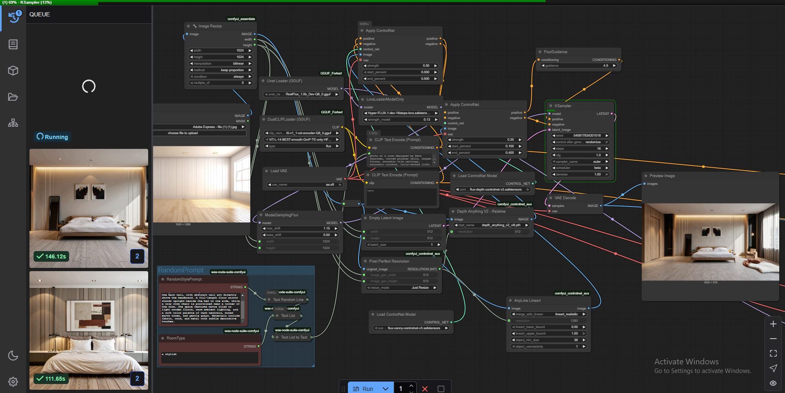
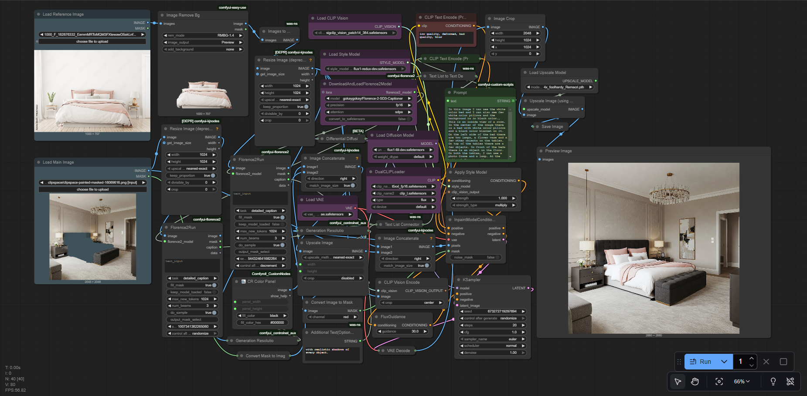

# ComfyUI Workflows

A collection of professional interior design workflows for ComfyUI using FLUX models.

## Workflows

### 1. Empty Room Redesign
**File:** `Empty_Room_Redesign.json`

Transforms empty rooms into fully furnished interior designs with multiple architectural styles.



**Features:**
- Random style selection from 40+ famous designers (Zaha Hadid, Frank Lloyd Wright, Le Corbusier, etc.)
- Dual-pass generation with ControlNet (Canny + Depth)
- Automatic upscaling with 4x models
- Customizable room types

**Key Nodes:**
- Model: RealFlux 1.0b (GGUF Q8_0)
- ControlNets: Canny v3 + Depth v3
- Upscaler: 4xRealWebPhoto v4
- LoRA: Hyper-FLUX (16-step & 8-step)

---

### 2. Inpainting Interior Pipeline
**File:** `inpainting_interior_pipeline.json`

Advanced inpainting workflow for selective interior redesign using reference images.



**Features:**
- FLUX Fill model for seamless inpainting
- Style transfer from reference images
- Automatic caption generation (Florence-2)
- Background removal for reference objects
- Redux-style conditioning

**Key Nodes:**
- Model: flux1-fill-dev
- Vision Model: SigCLIP + Redux
- Captioner: Florence-2-SD3
- Style strength control
- 4x upscaling post-process

---

## Requirements

### Models
```
GGUF UNET:
- RealFlux_1.0b_Dev-Q8_0.gguf

Text Encoders:
- t5-v1_1-xxl-encoder-Q8_0.gguf
- ViT-L-14-TEXT-detail-improved-hiT-GmP-TE-only-HF.safetensors

ControlNets:
- flux-canny-controlnet-v3.safetensors
- flux-depth-controlnet-v3.safetensors

Upscale Model:
- 4xRealWebPhoto_v4_dat2.pth
- 4x_foolhardy_Remacri.pth

LoRA:
- Hyper-FLUX.1-dev-16steps-lora.safetensors
- Hyper-FLUX.1-dev-8steps-lora.safetensors

Inpainting Models:
- flux1-fill-dev.safetensors
- flux1-redux-dev.safetensors
- sigclip_vision_patch14_384.safetensors
```

### ComfyUI Extensions
- ComfyUI_controlnet_aux
- ComfyUI-KJNodes
- ComfyUI-Florence2
- WAS Node Suite
- ComfyUI-Easy-Use
- Comfyroll Custom Nodes

---

## Usage

### Empty Room Redesign
1. Load input image (empty room)
2. Adjust resolution (default: 1024x1024)
3. (Optional) Modify room type and style prompt
4. Run workflow - generates 2-pass enhanced output

### Inpainting Pipeline
1. Load main image with mask (paint over areas to redesign)
2. Load reference image for style
3. Workflow auto-generates descriptive prompts
4. Customize additional text prompts
5. Run - outputs inpainted and upscaled result

## Tips

- **Empty Room Redesign:** Works best with clear architectural photos
- **Inpainting:** Mask precision affects quality - clean masks work best
- **Style Transfer:** Reference image should clearly show desired style/furniture
- **Performance:** First pass uses 16 steps, refine pass uses 8 steps for speed

## Credits

Workflows created for interior design automation using Flux models and ComfyUI.